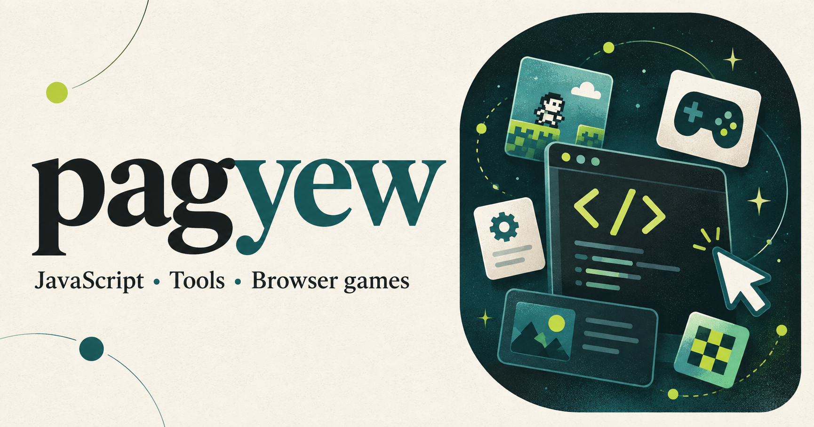

  
  <h1>Vladislav Tsepilov</h1>
  
<strong>Frontend Nonsenser 🌃 · JavaScript, TypeScript, and things for the browser.</strong>

  

    
    
    
    
  

  
<a href="#right-now">Right now</a> · <a href="#projects">Projects</a> · <a href="#quiz-lab">Quiz Lab</a> · <a href="#advent-of-code">Advent of Code</a> · <a href="#archive">Archive</a>

---

## 🚀 Right now

- 📍 Bishkek, Kyrgyzstan 🇰🇬 · building for **Yandex** in Moscow, Russia 🇷🇺
- 🧠 Growing a small family of instant browser quizzes on top of a shared `quiz-ui` engine
- 🃏 Teaching a Chrome extension to read the board and suggest moves for *Wingspan* on Board Game Arena — private, work in progress
- 🎄 Chipping away at Advent of Code, one December at a time

## 🧩 Projects

| Project                                                       | What it does                                                                |
| -------------------------------------------------------------- | ---------------------------------------------------------------------------- |
| [quiz-ui](https://github.com/pagyew/quiz-ui)                  | Framework-independent UI and game engine for type-to-reveal quizzes, with a CLI starter |
| [safolor](https://github.com/pagyew/safolor)                  | A typed utility that converts HEX/RGB colors to the 216-color web-safe palette |
| [Murkvan](https://github.com/pagyew/vscode-murkvan)            | A VS Code extension that watches your lockfile and offers to sync installed deps |
| [VS Code settings & snippets](https://github.com/pagyew/vscode-settings) | Personal editor setup, extension picks, and JS/TS/Vue snippets              |
| **Wingspan BGA Helper** 🔒                                     | Read-only Chrome extension: captures Wingspan game state on BGA and evaluates moves |

## 🧠 Quiz Lab

A little quiz universe built on the public [`quiz-ui`](https://github.com/pagyew/quiz-ui) engine — timed rounds, hints, and local best scores. Currently in private preview:

- 🔒 **tag-type-quiz** — name HTML elements by category
- 🔒 **prop-type-quiz** — name CSS properties by category
- 🔒 **method-type-quiz** — name JavaScript methods across data types

## 🎄 Advent of Code

| Year | Repository                                                              |
| ---- | ------------------------------------------------------------------------ |
| 2015 | [JavaScript implementations](https://github.com/pagyew/AoC-2015)        |
| 2016 | [JavaScript implementations](https://github.com/pagyew/AoC-2016)        |
| 2023 | [JavaScript and Python experiments](https://github.com/pagyew/AoC-2023) |
| 2024 | [Daily implementations and helpers](https://github.com/pagyew/AoC-2024) |

Start a new puzzle workspace with [AoC-template](https://github.com/pagyew/AoC-template).

## 🗄️ Archive

Earlier explorations of browser games, interfaces, and tooling:

**Canvas games** · [Pong](https://github.com/pagyew/pong) · [Tetris](https://github.com/pagyew/tetris) · [Super Mario](https://github.com/pagyew/supermario)

**Interfaces & tools** · [Todo List](https://github.com/pagyew/todolist) · [Todos 2.0](https://github.com/pagyew/todos-2.0) · [JSON Schedule Generator](https://github.com/pagyew/json-generator)

**Other explorations** · [Procedural Trees](https://github.com/pagyew/trees) · [YouTube Awesome](https://github.com/pagyew/youtube-awesome)

---

  
  

<!-- Сообщение сформировано агентом -->
